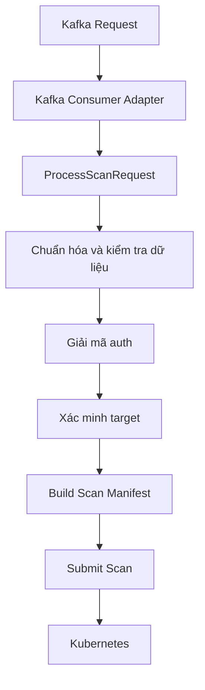
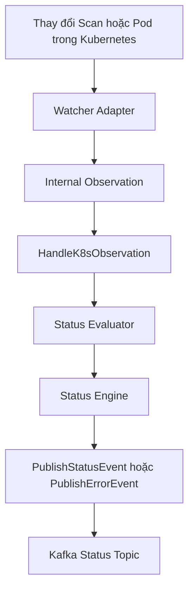
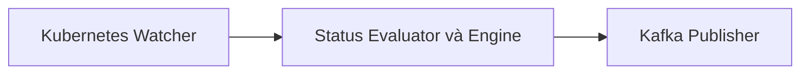

# scb-core-v2

`scb-core-v2` là nền tảng Go để viết lại `scb-core` theo hướng Clean Architecture.

Repo này được tổ chức như một bộ điều phối scan, không phải chỉ là một Kafka consumer đơn giản. Luồng xử lý chính của hệ thống là:

- nhận scan request từ Kafka
- chuẩn hóa và kiểm tra dữ liệu đầu vào
- xác minh target cần scan
- render manifest cho SecureCodeBox
- submit scan lên Kubernetes
- nhận observation từ watcher của Kubernetes
- đưa observation qua status engine để quyết định lifecycle stage
- publish status hoặc error event ra Kafka
- chạy cleanup job định kỳ

## Nguyên tắc kiến trúc

Repo hiện tại bám theo quy tắc này:

- Kubernetes phát hiện trạng thái
- Status engine quyết định trạng thái nghiệp vụ
- Kafka thông báo ra bên ngoài

Nói ngắn gọn:

- watcher của Kubernetes chỉ có nhiệm vụ phát hiện thay đổi runtime
- `internal/status` chịu trách nhiệm biến observation thành business stage, enforce thứ tự stage, bỏ event trùng và chặn transition sau terminal
- Kafka adapter chỉ publish event đã được quyết định, không tự suy luận lifecycle

## Các lớp trong repo

### 1. `internal/domain`

Chứa business core của hệ thống:

- entity như `ScanRequest`, `ScanTarget`, `ScanStatusEvent`, `ScanError`
- value object như `ScannerType`, `ScanStage`, `ProjectType`, `ErrorCode`
- domain service như scanner registry

Đây là nơi chứa các rule thuần:

- alias scanner được map về scanner nội bộ nào
- stage nào hợp lệ
- validation request theo từng loại scanner
- flatten `requestParams` cho nuclei

Layer này không nên biết gì về Kafka, Kubernetes hay HTTP client cụ thể.

### 2. `internal/usecase`

Chứa orchestration logic của ứng dụng:

- `ProcessScanRequest`
- `VerifyTarget`
- `DecryptAuthToken`
- `BuildScanManifest`
- `SubmitScan`
- `HandleK8sObservation`
- `PublishStatusEvent`
- `PublishErrorEvent`
- `CleanupScans`

Layer này gọi ra ngoài thông qua `ports`, không phụ thuộc trực tiếp vào framework hay SDK.

### 3. `internal/interfaceadapters`

Đây là lớp chuyển đổi dữ liệu giữa bên ngoài và mô hình nội bộ:

- controller nhận input rồi gọi use case
- mapper chuyển payload bên ngoài thành model nội bộ
- presenter chuyển event nội bộ thành payload outbound

Layer này không nên chứa business rule.

### 4. `internal/status`

Đây là phần quan trọng nhất của repo hiện tại.

- `engine.go`: enforce thứ tự lifecycle stage, dedupe và terminal handling
- `evaluator.go`: nhận observation signal rồi tạo ra decision status hoặc error

Package này là lớp “quyết định” nằm giữa watcher và Kafka publisher.

### 5. `internal/infrastructure`

Chứa adapter làm việc với hệ thống bên ngoài:

- `kafka`: consumer và publisher
- `k8s`: submit scan, watcher, cleanup repository
- `config`: load biến môi trường
- `crypto`: giải mã auth token
- `templates`: render manifest
- `httpclients`: verify repository, image hoặc URL
- `scheduler`: chạy cleanup theo lịch
- `logging`, `observability`: concern hạ tầng

Đây là outer layer, chỉ nên implement port cho use case.

### 6. `cmd/controller`

Đây là composition root:

- load config
- khởi tạo logger
- tạo adapter hạ tầng
- wire các use case
- start consumer, watcher và scheduler

## Hướng phụ thuộc

Dependency đi từ ngoài vào trong:

- infrastructure -> usecase/domain/status
- interface adapters -> usecase/domain
- usecase -> domain/status
- status -> domain
- domain -> không phụ thuộc layer ngoài

## Luồng chạy

### Luồng request



### Luồng observation



### Quy tắc tách trách nhiệm



## Sơ đồ src tree

```mermaid
flowchart TD
    root[scb-core-v2]
    root --> cmd[cmd/controller]
    root --> domain[internal/domain]
    root --> usecase[internal/usecase]
    root --> adapters[internal/interfaceadapters]
    root --> infra[internal/infrastructure]
    root --> status[internal/status]

    domain --> entities[entities]
    domain --> valueobjects[valueobjects]
    domain --> services[services]

    usecase --> contracts[contracts]
    usecase --> ports[ports]
    usecase --> requests[requests]
    usecase --> responses[responses]
    usecase --> servicesUC[services]

    adapters --> controllers[controllers]
    adapters --> mappers[mappers]
    adapters --> presenters[presenters]
    adapters --> repositories[repositories]

    infra --> config[config]
    infra --> kafka[kafka]
    infra --> k8s[k8s]
    infra --> crypto[crypto]
    infra --> templates[templates]
    infra --> httpclients[httpclients]
    infra --> logging[logging]
    infra --> scheduler[scheduler]
    infra --> observability[observability]
```



## Cây thư mục hiện tại

```text
cmd/
  controller/
    main.go

internal/
  domain/
    entities/
      cleanup_policy.go
      scan_error.go
      scan_manifest_spec.go
      scan_request.go
      scan_status_event.go
      scan_target.go
      verification_result.go
    services/
      scanner_registry.go
    valueobjects/
      error_code.go
      project_type.go
      scan_stage.go
      scanner_type.go
  infrastructure/
    config/
      config.go
    crypto/
      decryptor.go
    httpclients/
      verifiers.go
    k8s/
      cleanup_repository.go
      submitter.go
      watcher.go
    kafka/
      adapters.go
    logging/
      logger.go
    observability/
      noop.go
    scheduler/
      cleanup_scheduler.go
    templates/
      renderer.go
  interfaceadapters/
    controllers/
      kafka_scan_request_controller.go
    mappers/
      kafka_request_mapper.go
    presenters/
      status_presenter.go
    repositories/
      inmemory_status_store.go
  status/
    engine.go
    evaluator.go
  usecase/
    contracts/
      usecases.go
    ports/
      ports.go
    requests/
      process_scan_request.go
    responses/
      process_scan_request.go
    services/
      build_scan_manifest.go
      cleanup_scans.go
      decrypt_auth_token.go
      handle_k8s_observation.go
      process_scan_request.go
      publish_error_event.go
      publish_status_event.go
      submit_scan.go
      verify_target.go
```

## Nên đọc file nào trước

Nếu muốn hiểu repo nhanh, nên đọc theo thứ tự này:

1. `cmd/controller/main.go`
2. `internal/usecase/services/process_scan_request.go`
3. `internal/usecase/services/handle_k8s_observation.go`
4. `internal/status/engine.go`
5. `internal/status/evaluator.go`
6. `internal/domain/services/scanner_registry.go`
7. `internal/usecase/ports/ports.go`

## Trạng thái hiện tại của repo

Repo này đang là foundation cho quá trình rewrite:

- shape kiến trúc đã rõ
- ranh giới giữa Kafka, Kubernetes và status engine đã được tách
- các use case chính đã có vị trí rõ ràng
- adapter hạ tầng vẫn còn là placeholder ở nhiều chỗ

Các phần chưa hoàn thiện chủ yếu là implementation thật của:

- Kafka consumer và publisher
- controller-runtime watcher
- manifest rendering đầy đủ
- verify target thật
- decrypt auth thật
- cleanup behavior thật
